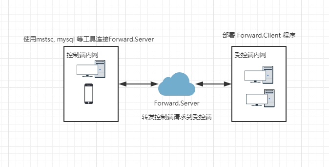
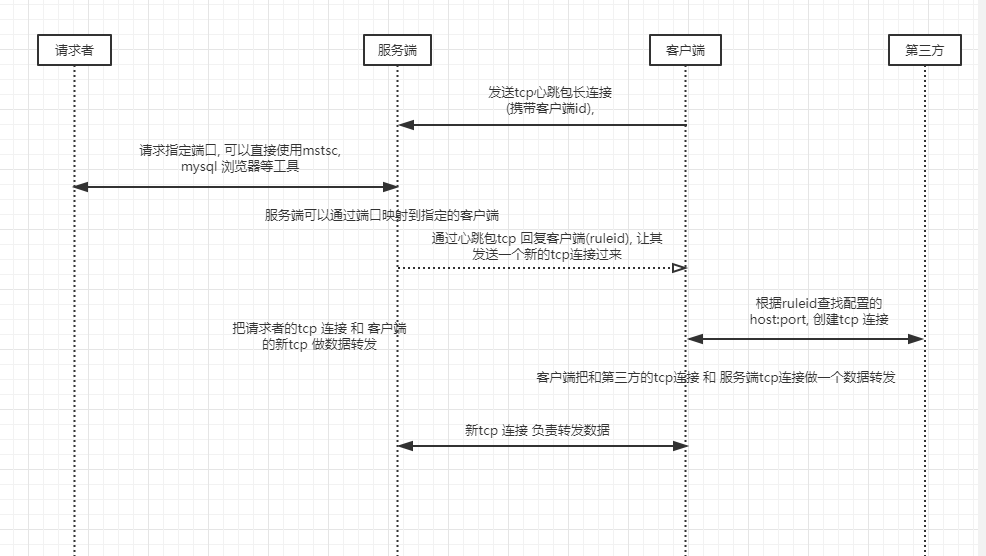

# 局域网内网穿透程序

## 前言

因为前段时间使用的 Teamviewer 需要商业授权, 咱也买不起, 就自己弄了这个内网穿透工具来远程公司电脑, 软件基于tcp/ip 数据转发实现, 不光可以实现远程桌面, 亦可以转发内网一些其他服务(数据库, 网站服务, 受控端有权访问的其他机器上的服务) 等

## 实现原理
> 系统由: 服务端, 受控制客户端, 第三方服务 请求连接者, 四个身份组成

1. 受控制客户端:
> 受控制客户端是我们内网的一台电脑, 没有外网ip, 但是需要给我外网访问电脑中的某个服务

2. 服务端:
> 服务端拥有外网ip, 负责转发数据

3. 第三方服务:
> 第三方是受控制客户端可以访问的一个服务, 但是外网访问不了, 需要我通过我们的服务端进行数据转发, 可以是www.baidu.com:80, 也可以是127.0.0.1:3389, 或者 192.168.0.22:1433

4. 请求者:
> 请求者访问服务器的指定端口, 然后请求会被转发, 通过 服务器--> 客户端 --> 第三方 的一个转发流程实现数据连接


5. 网络拓扑图
  


6. 下面是一个简单的时序图:
> 水平有限画的不是很清晰哈




## 部署安装
> 项目采用的是.net core 2.1 开发的, 服务端(Forward.Server)和客户端(Forward.Client)均可使用docker 进行部署, 
客户端可以使用Forward.Client.Service 安装成window 服务

1. 客户端配置文件说明

``` json

{
  "Forward": {
    "ServerHost": "127.0.0.1",  // 服务端ip
    "ServerPort": 5000,         // 服务端开放的心跳包端口
    "ClientId": "E01D607C0E3EFCC13D44A2DD21A83A5C",  // 客户端id, 和服务端配置要相同
    "ClientKey": "9oSKN7KV994EUBM5nDavr2Qdg5c3HsHOomEsMsJlL1GOErnTRnfcfw96wFuHTHeFqfgxWjhTTNIql2xOGhakdvzQcyV7X1r4M1opbOWy5kiqMIKu8F1BwSsUEolnnaVR" // // 客户端秘钥, 和服务端配置要相同
  },
  "ForwardRules": [
    {
      "RuleId": "abc_windows_mstsc",    // 转发规则id, 和服务端配置要相同
      "Host": "127.0.0.1",              // 第三方服务的ip
      "Port": 3389                      // 第三方服务的端口
    },
    {
      "RuleId": "abc_windows_mysql",
      "Host": "192.168.0.123",
      "Port": 3306
    },
    {
      "RuleId": "test_baidu",
      "Host": "www.baidu.com",
      "Port": 80
    }
  ]
}

```

2. 服务端配置文件说明

``` json

{
  "ListenerHeartbeatPort": 5000,    // 服务端侦听心跳包端口
  "Clients": [
    {
      "ClientId": "E01D607C0E3EFCC13D44A2DD21A83A5C",   // 客户端id
      "ClientKey": "9oSKN7KV994EUBM5nDavr2Qdg5c3HsHOomEsMsJlL1GOErnTRnfcfw96wFuHTHeFqfgxWjhTTNIql2xOGhakdvzQcyV7X1r4M1opbOWy5kiqMIKu8F1BwSsUEolnnaVR",      // 客户端秘钥
      "ForwardRules": [
        {
          "RuleId": "abc_windows_mstsc",    // 转发规则id
          "ListenerPort": 1389              // 侦听的端口, 如当1389 端口被访问了, 就服务端就会寻找到对应的RuleId和ClientId, 进而发送消息给客户端, 客户端在通过RuleId 和 第三方服务建立连接, 实现整体的数据转发过程
        },
        {
          "RuleId": "abc_windows_mysql",
          "ListenerPort": 1306
        },
        {
          "RuleId": "test_baidu",
          "ListenerPort": 8080
        }
      ]
    }
  ]
}

```
## 作用
> 本人一发现的用途 ^_^

1. 在家远程公司电脑(可以使用mstsc远程 或者 手机用 rd client 连接)
2. 需要把内网的服务临时授权给外部用户访问
3. 其他功能待挖掘....